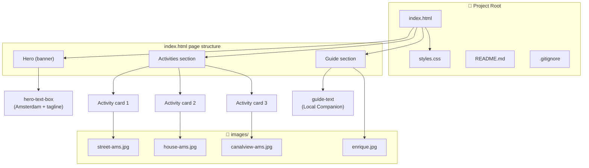
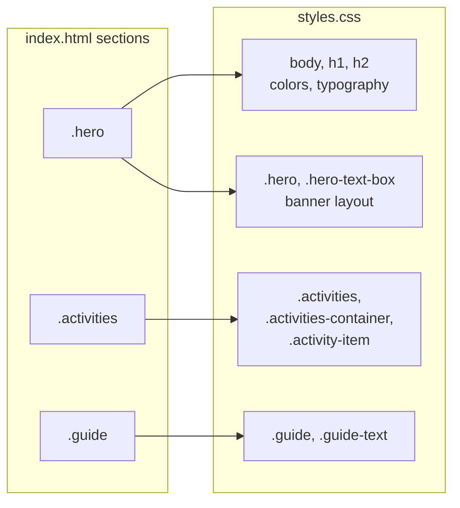

# Amsterdam Local Companion — Codebase Diagram

## Project structure & relationships



## Section → CSS mapping



## File tree (project assets only)

```
amsterdam-local-companion-project/
├── index.html          ← Single-page app entry
├── styles.css          ← Global & section styles
├── README.md
├── .gitignore
└── images/
    ├── street-ams.jpg   (activity: wander streets)
    ├── house-ams.jpg    (activity: canal house)
    ├── canalview-ams.jpg (activity: canal cruise)
    └── enrique.jpg      (guide avatar)
```

---

*View this file in an editor or GitHub that supports Mermaid to see the diagrams rendered.*
